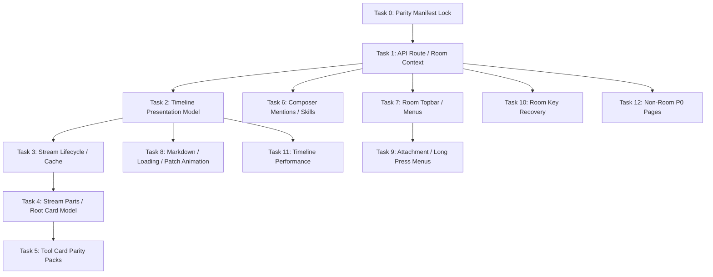

# Android iOS Parity Independent Tasks Implementation Plan

> **For agentic workers:** REQUIRED SUB-SKILL: Use superpowers:subagent-driven-development (recommended) or superpowers:executing-plans to implement this plan task-by-task. Steps use checkbox (`- [ ]`) syntax for tracking.

**Goal:** Split the Android-vs-iOS parity gap into independent, testable tasks so each feature can be implemented, reviewed, verified on device, and committed without mixing unrelated room, stream, card, and settings work.

**Architecture:** iOS remains the source of truth for request routes, state semantics, render order, and interaction behavior. Android implementation must move through request client/facade -> domain state -> reducer/render model -> Compose UI -> tests/device verification. Stream lifecycle and SSE parsing remain owned by Stream SDK; Android room UI consumes SDK snapshots and Android render models only.

**Tech Stack:** Kotlin, Jetpack Compose, Metro DI, Kotlin coroutines/Flow, Matrix Rust SDK, `libraries/chatbot`, `libraries/agentstream`, existing Android screenshot/unit test infrastructure.

---

## Ground Rules

- Do not start by adjusting Compose pixels. Every task must first prove the data source and render model.
- Do not bypass Stream SDK for stream lifecycle, SSE parse, cache, storage, or completed normalization.
- Do not parse raw tool JSON inside timeline Composables. Parse in adapters/reducers and pass typed props/render models.
- Preserve current dirty worktree changes. Do not reset or revert files unless explicitly requested.
- Each task should end with a commit. Use focused commits such as `feat: align room topbar model with ios`.
- Device acceptance must include PHK110 install and screenshots when the task changes UI or lifecycle behavior.

## Reference Documents

- Room parity manifest: `docs/ios-room-parity-manifest.md`
- Pages parity manifest: `docs/ios-pages-parity-manifest.md`
- Previous data-first plan: `docs/superpowers/plans/2026-06-14-android-room-ios-parity-data-first.md`
- iOS room source: `/Users/Ruihan/go/src/unseal-ios/ElementX/Sources/Screens/RoomScreen`
- iOS timeline source: `/Users/Ruihan/go/src/unseal-ios/ElementX/Sources/Screens/Timeline`
- iOS agent stream/card source: `/Users/Ruihan/go/src/unseal-agent-ios/UnsealUI`, `/Users/Ruihan/go/src/unseal-agent-ios/ToolCardsIOS`
- Android room source: `features/messages/impl/src/main/kotlin/io/element/android/features/messages/impl`
- Android Stream SDK wrapper: `libraries/agentstream`
- Android tool cards: `features/messages/impl/src/main/kotlin/io/element/android/features/messages/impl/timeline/components/event/toolcards`

## Task Dependency Map



---

### Task 0: Parity Manifest Lock

**Spec**

Create a single source of truth that converts the current checklist into a task board. The board must record iOS source files, Android source files, data owner, render model owner, tests, and device acceptance for every feature. This task does not change runtime code.

**Files:**
- Modify: `docs/ios-room-parity-manifest.md`
- Modify: `docs/ios-pages-parity-manifest.md`
- Modify: `HANDOFF_AGENT_MANAGEMENT.md`

**Plan**

- [ ] **Step 1: Add task IDs to room manifest**

  Add a `Task ID` column to each P0 room table in `docs/ios-room-parity-manifest.md`.

  Required IDs:
  - `ROOM-API`
  - `TIMELINE-PRESENTATION`
  - `STREAM-LIFECYCLE`
  - `STREAM-PARTS`
  - `TOOLCARDS`
  - `COMPOSER-SKILLS`
  - `ROOM-TOPBAR`
  - `ROOM-MENUS`
  - `ROOM-KEY-RECOVERY`
  - `PERF-CACHE`

- [ ] **Step 2: Add task IDs to pages manifest**

  Add `PAGE-*` IDs in `docs/ios-pages-parity-manifest.md`:
  - `PAGE-SETTINGS`
  - `PAGE-AGENTS`
  - `PAGE-SKILLS`
  - `PAGE-SCHEDULES`
  - `PAGE-WEBHOOKS`
  - `PAGE-VAULT`
  - `PAGE-CREDITS-STRIPE`
  - `PAGE-ONBOARDING`

- [ ] **Step 3: Update handoff**

  In `HANDOFF_AGENT_MANAGEMENT.md`, add a section named `iOS Parity Task Board` that links this plan and lists the current highest-priority task.

- [ ] **Step 4: Verify documentation**

  Run:

  ```bash
  rg -n "ROOM-API|TIMELINE-PRESENTATION|STREAM-LIFECYCLE|PAGE-CREDITS-STRIPE" docs/ios-room-parity-manifest.md docs/ios-pages-parity-manifest.md HANDOFF_AGENT_MANAGEMENT.md
  ```

  Expected: every task ID appears at least once.

- [ ] **Step 5: Commit**

  ```bash
  git add docs/ios-room-parity-manifest.md docs/ios-pages-parity-manifest.md HANDOFF_AGENT_MANAGEMENT.md docs/superpowers/plans/2026-06-15-ios-parity-independent-tasks.md
  git commit -m "docs: split ios parity work into independent tasks"
  ```

**Acceptance**

- A future agent can pick any task by ID and find source files, expected behavior, and verification steps.
- No runtime code is changed.

---

### Task 1: Room API Route And Shared Context

**Spec**

Android room features must use one shared room context matching iOS data semantics. Room UI, composer, skill picker, topbar, schedules, webhooks, and device-agent controls must not duplicate API calls or guess agent state independently.

**iOS Source**

- `/Users/Ruihan/go/src/unseal-ios/ElementX/Sources/Screens/RoomScreen/RoomScreenViewModel.swift`
- `/Users/Ruihan/go/src/unseal-ios/ElementX/Sources/Screens/Timeline/TimelineViewModel.swift`
- `/Users/Ruihan/go/src/unseal-ios/ElementX/Sources/Screens/RoomScreen/ComposerToolbar/ComposerToolbarViewModel.swift`

**Android Files**

- Modify: `features/messages/impl/src/main/kotlin/io/element/android/features/messages/impl/roomdata/RoomUnsealModels.kt`
- Modify: `features/messages/impl/src/main/kotlin/io/element/android/features/messages/impl/roomdata/DefaultRoomUnsealDataClient.kt`
- Modify: `features/messages/impl/src/main/kotlin/io/element/android/features/messages/impl/roomdata/RoomUnsealContextStore.kt`
- Modify: `features/messages/impl/src/main/kotlin/io/element/android/features/messages/impl/MessagesPresenter.kt`
- Test: `features/messages/impl/src/test/kotlin/io/element/android/features/messages/impl/roomdata/RoomUnsealContextLoaderTest.kt`
- Test: `features/messages/impl/src/test/kotlin/io/element/android/features/messages/impl/roomdata/DefaultRoomUnsealDataClientTest.kt`

**Plan**

- [ ] **Step 1: Write route tests**

  Add tests proving:
  - room agents, schedules, room skills, legacy skills use `createForHomeserver`.
  - credits/connectors/global webhook catalog do not use this room facade.
  - partial failures keep other resources.

  Run:

  ```bash
  ./gradlew :features:messages:impl:testDebugUnitTest --tests '*RoomUnseal*' --no-daemon --console=plain
  ```

  Expected before implementation: failing test for any missing route or missing partial-resource handling.

- [ ] **Step 2: Complete context fields**

  Ensure `RoomUnsealContext` exposes:
  - `members`
  - `agentsInRoom`
  - `hasAgentInRoom`
  - `deviceAgentInRoom`
  - `activeScheduleCount`
  - `webhookSummary`
  - `workingMemory`
  - `agentSkillTargets`

- [ ] **Step 3: Centralize refresh**

  Add explicit refresh reasons:
  - member changed
  - schedule changed
  - webhook changed
  - skill catalog changed
  - app resumed

- [ ] **Step 4: Remove duplicate room calls**

  Replace room-screen duplicate calls with context reads. Do not delete page-specific clients for non-room pages.

- [ ] **Step 5: Run tests**

  ```bash
  ./gradlew :features:messages:impl:testDebugUnitTest --tests '*RoomUnseal*' --no-daemon --console=plain
  ```

- [ ] **Step 6: Commit**

  ```bash
  git add features/messages/impl/src/main/kotlin/io/element/android/features/messages/impl/roomdata \
    features/messages/impl/src/main/kotlin/io/element/android/features/messages/impl/MessagesPresenter.kt \
    features/messages/impl/src/test/kotlin/io/element/android/features/messages/impl/roomdata
  git commit -m "feat: centralize room unseal context"
  ```

**Acceptance**

- One room context owns room agents/schedules/webhooks/working memory.
- Topbar, composer, skill picker, and room menu can consume context without their own API calls.
- Tests prove homeserver/unseal route split.

---

### Task 2: Timeline Presentation Model Parity

**Spec**

Timeline row layout must be driven by a stable presentation model. AI stream, markdown, room-key recovery, normal text, self messages, other messages, grouped messages, date dividers, typing, reactions, and read receipts must not choose bubble/spacing policy inside ad hoc Composable branches.

**iOS Source**

- `/Users/Ruihan/go/src/unseal-ios/ElementX/Sources/Screens/Timeline/View/TimelineView.swift`
- `/Users/Ruihan/go/src/unseal-ios/ElementX/Sources/Screens/Timeline/View/Style/TimelineItemBubbledStylerView.swift`
- `/Users/Ruihan/go/src/unseal-ios/ElementX/Sources/Screens/Timeline/View/Style/TimelineBubbleLayout.swift`
- `/Users/Ruihan/go/src/unseal-agent-ios/UnsealUI/Views/BubbleMessageView.swift`

**Android Files**

- Modify: `features/messages/impl/src/main/kotlin/io/element/android/features/messages/impl/timeline/model/TimelinePresentationModel.kt`
- Modify: `features/messages/impl/src/main/kotlin/io/element/android/features/messages/impl/timeline/components/TimelineItemEventRow.kt`
- Modify: `features/messages/impl/src/main/kotlin/io/element/android/features/messages/impl/timeline/components/event/TimelineItemAiView.kt`
- Test: `features/messages/impl/src/test/kotlin/io/element/android/features/messages/impl/timeline/model/TimelinePresentationReducerTest.kt`

**Plan**

- [ ] **Step 1: Write row-policy tests**

  Test cases:
  - outgoing normal text
  - incoming normal text
  - AI stream with tool card
  - AI stream with markdown only
  - room-key recovery card
  - event with reactions
  - event with reply preview
  - grouped first/middle/last

- [ ] **Step 2: Add explicit model fields**

  `TimelinePresentationModel` must include:
  - `alignment`
  - `bubblePolicy`
  - `avatarPolicy`
  - `senderLabelPolicy`
  - `timestampPolicy`
  - `editedPolicy`
  - `contentWidthPolicy`
  - `rightGutterPolicy`
  - `supplementaryPolicy`

- [ ] **Step 3: Remove fallback bubble leaks**

  Ensure AI stream, room-key recovery, and standalone markdown do not fall back to old bubble layout when they have reply/reaction/status children.

- [ ] **Step 4: Run targeted tests**

  ```bash
  ./gradlew :features:messages:impl:testDebugUnitTest --tests '*TimelinePresentationReducerTest' --no-daemon --console=plain
  ```

- [ ] **Step 5: Device screenshot**

  Install and capture:

  ```bash
  ./gradlew :app:installGplayDebug --no-daemon --console=plain
  ```

  Required screenshots:
  - normal self text
  - normal other text
  - AI stream card + markdown
  - room-key recovery card

- [ ] **Step 6: Commit**

  ```bash
  git add features/messages/impl/src/main/kotlin/io/element/android/features/messages/impl/timeline \
    features/messages/impl/src/test/kotlin/io/element/android/features/messages/impl/timeline/model
  git commit -m "feat: align timeline presentation policy with ios"
  ```

**Acceptance**

- No AI stream/card content is wrapped in a giant ordinary chat bubble.
- Self and other row policies are consistent with iOS.
- Recovery card no longer appears as an old bubble.

---

### Task 3: Stream Lifecycle, Cache, And Completed First Frame

**Spec**

Completed streams must render from memory/store immediately and must not reopen network or flash loading when timeline cells recycle. Visible UI listeners may be cancelled, but background stream completion and store writes must continue.

**iOS Source**

- `/Users/Ruihan/go/src/unseal-agent-ios/UnsealUI/Views/BubbleMessageView.swift`
- `/Users/Ruihan/go/src/unseal-agent-ios/UnsealAgent/StreamModels`

**Android Files**

- Modify: `libraries/agentstream/src/main/kotlin/io/element/android/libraries/agentstream/api/DefaultAgentStreamClient.kt`
- Modify: `libraries/agentstream/src/main/kotlin/io/element/android/libraries/agentstream/api/AgentStreamSession.kt`
- Modify: `features/messages/impl/src/main/kotlin/io/element/android/features/messages/impl/timeline/components/event/TimelineItemAiPresenter.kt`
- Modify: `features/messages/impl/src/main/kotlin/io/element/android/features/messages/impl/timeline/factories/event/AiStreamContentCache.kt`
- Test: `libraries/agentstream/src/test/kotlin/io/element/android/libraries/agentstream/api/DefaultAgentStreamClientTest.kt`
- Test: `libraries/agentstream/src/test/kotlin/io/element/android/libraries/agentstream/api/StreamSnapshotUpdatePolicyTest.kt`

**Plan**

- [ ] **Step 1: Write lifecycle tests**

  Test:
  - same `streamId` returns same handle while in-flight
  - listener cancellation does not cancel background fetch
  - completed stream emits final snapshot immediately from memory
  - store hit does not call network
  - completed snapshot has no running tool state

- [ ] **Step 2: Normalize completed snapshots in SDK**

  Ensure Stream SDK emits final completed snapshot immediately after SSE end/store hit.

- [ ] **Step 3: Update Android presenter**

  `TimelineItemAiPresenter` must subscribe/unsubscribe UI listener without owning stream lifecycle.

- [ ] **Step 4: Run SDK tests**

  ```bash
  ./gradlew :libraries:agentstream:testDebugUnitTest --no-daemon --console=plain
  ```

- [ ] **Step 5: Run messages tests**

  ```bash
  ./gradlew :features:messages:impl:testDebugUnitTest --tests '*Ai*' --no-daemon --console=plain
  ```

- [ ] **Step 6: Commit**

  ```bash
  git add libraries/agentstream features/messages/impl/src/main/kotlin/io/element/android/features/messages/impl/timeline
  git commit -m "fix: render completed streams from cache first"
  ```

**Acceptance**

- Scrolling away/back to a completed stream does not show loading.
- Logs show no duplicate fetch for completed `streamId`.
- Running tool states are not left behind after completed stream.

---

### Task 4: Stream Parts And Tool Root Render Model

**Spec**

Android must mirror iOS stream render ordering: parts drive UI; root tool card is inserted once at the first visible tool part; absorbed tool parts are not rendered again; text/reasoning/data/error/source/file parts keep their state and order.

**iOS Source**

- `/Users/Ruihan/go/src/unseal-agent-ios/UnsealUI/Views/BubbleMessageView.swift`
- `/Users/Ruihan/go/src/unseal-agent-ios/UnsealUI/Views/UIParts/Utils/ToolGroupUtils.swift`
- `/Users/Ruihan/go/src/unseal-agent-ios/UnsealUI/Views/UIParts/ToolParts/ToolCallRootCardAdapter.swift`
- `/Users/Ruihan/go/src/unseal-agent-ios/ToolCardsIOS/Sources/ToolCardsIOS/ToolCallRootCard.swift`

**Android Files**

- Modify: `features/messages/impl/src/main/kotlin/io/element/android/features/messages/impl/timeline/components/event/AndroidAgentStreamAdapters.kt`
- Modify: `features/messages/impl/src/main/kotlin/io/element/android/features/messages/impl/timeline/components/event/AiToolCardLogic.kt`
- Modify: `features/messages/impl/src/main/kotlin/io/element/android/features/messages/impl/timeline/components/event/toolcards/ToolCallRootCardAdapter.kt`
- Modify: `features/messages/impl/src/main/kotlin/io/element/android/features/messages/impl/timeline/components/event/TimelineItemAiView.kt`
- Test: `features/messages/impl/src/test/kotlin/io/element/android/features/messages/impl/timeline/components/event/AiToolCardLogicTest.kt`

**Plan**

- [ ] **Step 1: Write part-order tests**

  Fixtures:
  - text only
  - reasoning + text
  - one tool + text
  - multiple tools + text
  - hidden/meta tool + registered tool
  - data error card
  - approval/suspended card

- [ ] **Step 2: Add `AiStreamRenderModel` invariants**

  Enforce:
  - `firstToolPartIndex`
  - `toolCardEntries`
  - `visibleParts`
  - `markdownBlocks`
  - `isStreaming`
  - `cursorMode`
  - `renderVersion`

- [ ] **Step 3: Add root card model invariants**

  Enforce:
  - single tool has no tab strip
  - multiple tools have selected index
  - state maps match iOS: input/inputStreaming -> calling, output/approval responded -> done, outputError/denied -> error

- [ ] **Step 4: Run tests**

  ```bash
  ./gradlew :features:messages:impl:testDebugUnitTest --tests '*AiTool*' --tests '*Stream*' --no-daemon --console=plain
  ```

- [ ] **Step 5: Commit**

  ```bash
  git add features/messages/impl/src/main/kotlin/io/element/android/features/messages/impl/timeline/components/event \
    features/messages/impl/src/test/kotlin/io/element/android/features/messages/impl/timeline/components/event
  git commit -m "feat: derive ai stream render model from parts"
  ```

**Acceptance**

- UI can be described as `UI = f(parts/renderModel)`.
- No raw event parsing in card Composables.
- Root card insertion matches iOS.

---

### Task 5: Tool Card Parity Packs

**Spec**

Cards must transform raw tool payloads into meaningful props and render iOS-equivalent content. No user-facing raw JSON fallback for known cards. Empty known cards must collapse to compact state, not reserve large blank space.

**iOS Source**

- `/Users/Ruihan/go/src/unseal-agent-ios/ToolCardsIOS/Sources/ToolCardsIOS`
- `/Users/Ruihan/go/src/unseal-agent-ios/ToolCardsIOS/Sources/ToolCardsIOS/CardTransforms.swift`

**Android Files**

- Modify: `features/messages/impl/src/main/kotlin/io/element/android/features/messages/impl/timeline/components/event/toolcards/CardTransforms.kt`
- Modify: `features/messages/impl/src/main/kotlin/io/element/android/features/messages/impl/timeline/components/event/toolcards/ComposioSearchCards.kt`
- Modify: `features/messages/impl/src/main/kotlin/io/element/android/features/messages/impl/timeline/components/event/toolcards/GmailDriveCards.kt`
- Modify: `features/messages/impl/src/main/kotlin/io/element/android/features/messages/impl/timeline/components/event/toolcards/GitHubCardsPrimary.kt`
- Modify: `features/messages/impl/src/main/kotlin/io/element/android/features/messages/impl/timeline/components/event/toolcards/GitHubCardsActivity.kt`
- Modify: `features/messages/impl/src/main/kotlin/io/element/android/features/messages/impl/timeline/components/event/toolcards/ScheduleMoltbookCards.kt`
- Test resources: `features/messages/impl/src/test/resources/toolcards/fixtures`

**Plan**

- [ ] **Step 1: Pack A - Search/Travel/Commerce**

  Cards:
  - weather
  - finance
  - news/web/url content
  - shopping
  - places
  - hotels
  - flights/events/images

  Tests:

  ```bash
  ./gradlew :features:messages:impl:testDebugUnitTest --tests '*ToolCard*' --no-daemon --console=plain
  ```

- [ ] **Step 2: Pack B - Workspace/Files/Email**

  Cards:
  - Gmail fetch message
  - Gmail fetch emails
  - Gmail draft
  - Drive file list
  - Drive metadata

- [ ] **Step 3: Pack C - GitHub/Linear/Twitter/Schedules**

  Cards:
  - GitHub issues/list/search/PR/checks/compare/contributors/deployments/notifications/orgs/releases/repos/secrets/workflows/comments
  - Linear issue/list
  - Twitter feed/search/post
  - schedule create/update/status

- [ ] **Step 4: Pack D - Suspended/Approval/Error**

  Cards:
  - request vault authorization
  - delete schedule
  - sandbox mode
  - choose request
  - Moltbook register
  - error card

- [ ] **Step 5: Device acceptance**

  Ask the agent to produce one stream per card pack. Capture screenshots for light/dark where possible. Required cards:
  - weather
  - finance
  - news
  - shopping
  - places/hotels
  - files
  - email
  - GitHub search/compare
  - schedule

- [ ] **Step 6: Commit per pack**

  Use one commit per pack:

  ```bash
  git commit -m "feat: align composio tool cards with ios"
  git commit -m "feat: align gmail drive tool cards with ios"
  git commit -m "feat: align developer tool cards with ios"
  git commit -m "feat: align suspended tool cards with ios"
  ```

**Acceptance**

- Known card types never show raw JSON.
- Empty card content does not create a large blank panel.
- Tool card content is meaningful and visually close to iOS screenshots.

---

### Task 6: Composer Mentions And Agent Skill Picker

**Spec**

Composer suggestions and skills must use enriched room member/agent data. Agent mention, slash/direct-agent flow, runtime skills, legacy fallback, and selected skill metadata must match iOS send semantics.

**iOS Source**

- `/Users/Ruihan/go/src/unseal-ios/ElementX/Sources/Screens/RoomScreen/ComposerToolbar/ComposerToolbarViewModel.swift`
- `/Users/Ruihan/go/src/unseal-ios/ElementX/Sources/Screens/RoomScreen/ComposerToolbar/CompletionSuggestionService.swift`
- `/Users/Ruihan/go/src/unseal-ios/ElementX/Sources/Screens/Timeline/TimelineViewModel.swift`

**Android Files**

- Modify: `features/messages/impl/src/main/kotlin/io/element/android/features/messages/impl/messagecomposer/MessageComposerPresenter.kt`
- Modify: `features/messages/impl/src/main/kotlin/io/element/android/features/messages/impl/messagecomposer/skills`
- Modify: `features/messages/impl/src/main/kotlin/io/element/android/features/messages/impl/messagecomposer/suggestions`
- Modify: `features/messages/impl/src/main/kotlin/io/element/android/features/messages/impl/MessagesView.kt`
- Test: `features/messages/impl/src/test/kotlin/io/element/android/features/messages/impl/messagecomposer/MessageComposerPresenterTest.kt`

**Plan**

- [ ] **Step 1: Write suggestion tests**

  Test:
  - self excluded
  - joined members included
  - agent badge included
  - direct agent room resolves target
  - `@room` gated by room type/power

- [ ] **Step 2: Write skill catalog tests**

  Test:
  - runtime visible skills preferred
  - legacy fallback only used when runtime unavailable
  - selected skills are emitted in raw Matrix content
  - `device_id` is top-level for device-agent chat

- [ ] **Step 3: Align picker render model**

  Ensure picker state includes:
  - targets
  - active target
  - selected skills
  - loading/error
  - source labels
  - empty state

- [ ] **Step 4: Run tests**

  ```bash
  ./gradlew :features:messages:impl:testDebugUnitTest --tests '*MessageComposerPresenterTest' --no-daemon --console=plain
  ```

- [ ] **Step 5: Commit**

  ```bash
  git add features/messages/impl/src/main/kotlin/io/element/android/features/messages/impl/messagecomposer \
    features/messages/impl/src/main/kotlin/io/element/android/features/messages/impl/MessagesView.kt \
    features/messages/impl/src/test/kotlin/io/element/android/features/messages/impl/messagecomposer
  git commit -m "feat: align composer agent skills with ios"
  ```

**Acceptance**

- Agent mention and skill picker use the same room context.
- Selected skills and device-agent chat payloads match iOS.

---

### Task 7: Room Topbar, Floating Chrome, And Room Menus

**Spec**

Android room chrome must match iOS interaction semantics: floating header controls, independent ellipsis menu, no layout push when expanded, schedules/device-agent visibility from room context, and topbar tools ordered like iOS.

**iOS Source**

- `/Users/Ruihan/go/src/unseal-ios/ElementX/Sources/Screens/RoomScreen/View/RoomScreen.swift`
- `/Users/Ruihan/go/src/unseal-ios/ElementX/Sources/Screens/RoomScreen/RoomScreenViewModel.swift`

**Android Files**

- Modify: `features/messages/impl/src/main/kotlin/io/element/android/features/messages/impl/roomdata/RoomMenuRenderModel.kt`
- Modify: `features/messages/impl/src/main/kotlin/io/element/android/features/messages/impl/MessagesViewTopBar.kt`
- Modify: `features/messages/impl/src/main/kotlin/io/element/android/features/messages/impl/MessagesView.kt`
- Test: `features/messages/impl/src/test/kotlin/io/element/android/features/messages/impl/roomdata/RoomMenuReducerTest.kt`

**Plan**

- [ ] **Step 1: Write reducer tests**

  Cases:
  - ordinary room hides room tools
  - agent room shows schedules when agent present
  - device-agent room shows terminal and device chat
  - menu order is terminal, device chat, schedules
  - active chat indicator only when device chat active

- [ ] **Step 2: Align render model**

  `RoomMenuRenderModel` must expose:
  - `topbarPrimaryActions`
  - `topbarToolActions`
  - `scheduleBadge`
  - `deviceAgentChatActive`
  - `roomToolsVisible`

- [ ] **Step 3: Align topbar UI**

  UI requirements:
  - floating back button
  - floating room title pill
  - separate call/video button
  - separate ellipsis button
  - expanded menu overlays downward and does not push timeline

- [ ] **Step 4: Device verification**

  Capture:
  - collapsed topbar
  - expanded room tools
  - non-agent room with no room tools
  - device-agent room with terminal/chat

- [ ] **Step 5: Commit**

  ```bash
  git add features/messages/impl/src/main/kotlin/io/element/android/features/messages/impl/roomdata \
    features/messages/impl/src/main/kotlin/io/element/android/features/messages/impl/MessagesViewTopBar.kt \
    features/messages/impl/src/main/kotlin/io/element/android/features/messages/impl/MessagesView.kt \
    features/messages/impl/src/test/kotlin/io/element/android/features/messages/impl/roomdata
  git commit -m "feat: align room topbar tools with ios"
  ```

**Acceptance**

- Expanding menu never shifts title, composer, or timeline.
- Visual shape is close enough to iOS for demo screenshots.

---

### Task 8: Markdown, Loading, And Stream Patch Animation

**Spec**

Streaming text should feel like iOS: no raw `Thinking...` card as final content, cursor/loading is state-based, completed markdown is cached, links are clickable, and patch updates are throttled without missing state changes.

**iOS Source**

- `/Users/Ruihan/go/src/unseal-ios/ElementX/Sources/Screens/Timeline/View/TimelineItemViews/AIMessage/SwiftMarkdownView.swift`
- `/Users/Ruihan/go/src/unseal-agent-ios/UnsealUI/Views/BubbleMessageView.swift`
- `/Users/Ruihan/go/src/unseal-agent-ios/UnsealAgent/Views/MarkdownView.swift`

**Android Files**

- Modify: `features/messages/impl/src/main/kotlin/io/element/android/features/messages/impl/timeline/components/event/MarkdownBody.kt`
- Modify: `features/messages/impl/src/main/kotlin/io/element/android/features/messages/impl/timeline/components/event/TimelineItemAiView.kt`
- Modify: `libraries/agentstream/src/main/kotlin/io/element/android/libraries/agentstream/api/StreamSnapshotUpdatePolicy.kt`
- Test: `libraries/agentstream/src/test/kotlin/io/element/android/libraries/agentstream/api/StreamSnapshotUpdatePolicyTest.kt`

**Plan**

- [ ] **Step 1: Add update policy tests**

  Requirements:
  - state changes emit immediately
  - content-only patches merge within 300-500ms
  - completed emits final immediately
  - no emit when state/content unchanged

- [ ] **Step 2: Add markdown cache**

  Cache completed markdown render data by stable content hash or stream render version. Streaming content may recompute.

- [ ] **Step 3: Replace literal thinking fallback**

  Loading UI must be state-driven from `AiStreamRenderModel.cursorMode`.

- [ ] **Step 4: Link acceptance**

  Verify link taps in markdown and card content open expected URLs.

- [ ] **Step 5: Commit**

  ```bash
  git add libraries/agentstream features/messages/impl/src/main/kotlin/io/element/android/features/messages/impl/timeline/components/event
  git commit -m "feat: align stream markdown loading updates with ios"
  ```

**Acceptance**

- No completed AI message displays a literal loading placeholder.
- Text appears progressively without large UI stalls.

---

### Task 9: Attachment Menu And Message Long Press Menu

**Spec**

Room menus must be model-driven and match iOS action availability. Missing iOS actions should be explicitly represented as unavailable/blocked until bottom-layer support exists.

**iOS Source**

- `/Users/Ruihan/go/src/unseal-ios/ElementX/Sources/Screens/RoomScreen/ComposerToolbar/View/RoomAttachmentPicker.swift`
- `/Users/Ruihan/go/src/unseal-ios/ElementX/Sources/Screens/Timeline/View/ItemMenu/TimelineItemMenuActionProvider.swift`
- `/Users/Ruihan/go/src/unseal-ios/ElementX/Sources/Screens/Timeline/View/ItemMenu/TimelineItemMenuAction.swift`

**Android Files**

- Modify: `features/messages/impl/src/main/kotlin/io/element/android/features/messages/impl/roomdata/RoomMenuRenderModel.kt`
- Modify: `features/messages/impl/src/main/kotlin/io/element/android/features/messages/impl/actionlist/model/TimelineItemAction.kt`
- Modify: `features/messages/impl/src/main/kotlin/io/element/android/features/messages/impl/actionlist/model/MessageActionMenuRenderModel.kt`
- Modify: `features/messages/impl/src/main/kotlin/io/element/android/features/messages/impl/MessagesView.kt`
- Test: `features/messages/impl/src/test/kotlin/io/element/android/features/messages/impl/actionlist`

**Plan**

- [ ] **Step 1: Attachment model tests**

  Expected iOS order:
  - game
  - text formatting
  - poll
  - ping
  - sketch
  - location
  - files
  - photo library
  - camera

  Android must either implement or mark ping/sketch unavailable.

- [ ] **Step 2: Long-press action tests**

  Expected iOS actions:
  - reply/thread
  - forward
  - edit/caption
  - copy permalink
  - pin/unpin
  - save/unsave
  - select text
  - copy
  - translate
  - view source
  - report
  - redact
  - media share/save

- [ ] **Step 3: Add unavailable action model**

  Do not silently drop actions if the user expects iOS parity. Add a reason such as `RequiresBottomLayer`.

- [ ] **Step 4: Device screenshots**

  Capture:
  - attachment sheet
  - text message long-press
  - AI stream long-press
  - media long-press

- [ ] **Step 5: Commit**

  ```bash
  git add features/messages/impl/src/main/kotlin/io/element/android/features/messages/impl/roomdata \
    features/messages/impl/src/main/kotlin/io/element/android/features/messages/impl/actionlist \
    features/messages/impl/src/main/kotlin/io/element/android/features/messages/impl/MessagesView.kt \
    features/messages/impl/src/test/kotlin/io/element/android/features/messages/impl/actionlist
  git commit -m "feat: align room action menus with ios"
  ```

**Acceptance**

- Attachment and long-press menus have explicit parity contracts.
- Missing actions are visible in tests as intentionally unavailable, not forgotten.

---

### Task 10: Room Key Recovery Flow

**Spec**

Android restore-room-key behavior must match iOS recovery order and target selection: backup, own devices, sender, room members. Room member fallback must exclude agents, self, and sender as iOS does.

**iOS Source**

- `/Users/Ruihan/go/src/unseal-ios/ElementX/Sources/Screens/Timeline/TimelineViewModel.swift`
- `/Users/Ruihan/go/src/unseal-ios/ElementX/Sources/Screens/Timeline/View/TimelineItemViews/EncryptedRoomTimelineView.swift`

**Android Files**

- Modify: `features/messages/impl/src/main/kotlin/io/element/android/features/messages/impl/roomkey/RoomKeyRecoveryPlanner.kt`
- Modify: `features/messages/impl/src/main/kotlin/io/element/android/features/messages/impl/roomkey/RoomKeyRecoveryCoordinator.kt`
- Modify: `features/messages/impl/src/main/kotlin/io/element/android/features/messages/impl/roomkey/RoomKeyDecryptionRetrier.kt`
- Modify: `features/messages/impl/src/main/kotlin/io/element/android/features/messages/impl/timeline/components/event/TimelineItemEncryptedView.kt`
- Test: `features/messages/impl/src/test/kotlin/io/element/android/features/messages/impl/roomkey`

**Plan**

- [ ] **Step 1: Write target-selection tests**

  Cases:
  - backup available
  - own verified device available
  - sender available
  - room members available
  - agents excluded from member fallback
  - self excluded
  - sender excluded from members fallback

- [ ] **Step 2: Align stage model**

  Stage model:
  - checking backup
  - own devices
  - sender
  - members
  - resolved
  - failed

- [ ] **Step 3: Align UI render model**

  Recovery card must use timeline presentation policy, not old bubble fallback.

- [ ] **Step 4: Device acceptance**

  Use a room with a missing key event. Verify:
  - card not bubble-styled
  - retry/progress state stable
  - scroll position does not jump after recovery state update

- [ ] **Step 5: Commit**

  ```bash
  git add features/messages/impl/src/main/kotlin/io/element/android/features/messages/impl/roomkey \
    features/messages/impl/src/main/kotlin/io/element/android/features/messages/impl/timeline/components/event \
    features/messages/impl/src/test/kotlin/io/element/android/features/messages/impl/roomkey
  git commit -m "feat: align room key recovery flow with ios"
  ```

**Acceptance**

- Recovery order and target exclusions match iOS.
- Recovery UI no longer uses old bubble styling.

---

### Task 11: Timeline Performance And Scroll Stability

**Spec**

Scrolling through stream/card-heavy timeline must not stutter when new stream regions enter viewport. Layout must not jump after the finger stops. Completed streams, markdown, tool card props, and image requests must be memoized or cached outside hot Composable paths.

**iOS Source**

- `/Users/Ruihan/go/src/unseal-ios/ElementX/Sources/Screens/Timeline/TimelineTableViewController.swift`
- `/Users/Ruihan/go/src/unseal-ios/ElementX/Sources/Screens/Timeline/View/Style/TimelineBubbleLayout.swift`

**Android Files**

- Modify: `features/messages/impl/src/main/kotlin/io/element/android/features/messages/impl/timeline/TimelineView.kt`
- Modify: `features/messages/impl/src/main/kotlin/io/element/android/features/messages/impl/timeline/components/TimelineItemEventRow.kt`
- Modify: `features/messages/impl/src/main/kotlin/io/element/android/features/messages/impl/timeline/components/event/TimelineItemAiView.kt`
- Modify: `features/messages/impl/src/main/kotlin/io/element/android/features/messages/impl/timeline/factories/event/AiStreamContentCache.kt`
- Modify: `features/messages/impl/src/main/kotlin/io/element/android/features/messages/impl/timeline/components/event/toolcards/CardTransforms.kt`

**Plan**

- [ ] **Step 1: Add logging counters**

  Temporary debug counters:
  - stream handle create count
  - card props transform count
  - markdown parse count
  - image request count

- [ ] **Step 2: Stabilize LazyColumn keys**

  Verify each timeline item has stable key and stream cells do not recreate session on recomposition.

- [ ] **Step 3: Memoize transforms**

  Cache tool card props by:
  - streamId
  - part id
  - renderVersion
  - cardType

- [ ] **Step 4: Memoize completed markdown**

  Cache completed markdown render data by content hash.

- [ ] **Step 5: Device acceptance**

  On PHK110:
  - fast scroll up/down through multiple completed streams
  - verify no visible loading flash for completed stream
  - verify no finger-stop jump
  - collect log counters

- [ ] **Step 6: Remove temporary noisy logs or gate them behind debug flag**

- [ ] **Step 7: Commit**

  ```bash
  git add features/messages/impl/src/main/kotlin/io/element/android/features/messages/impl/timeline
  git commit -m "perf: stabilize stream timeline scrolling"
  ```

**Acceptance**

- Completed streams do not refetch or reparse on every recycle.
- Scroll remains stable when cards enter viewport.

---

### Task 12: Non-Room P0 Pages Parity Queue

**Spec**

Non-room pages must be handled as separate page tasks. Each page must define iOS source, request route, domain state, render model, UI parity, and verification. Do not mix these into room timeline work.

**Reference**

- `docs/ios-pages-parity-manifest.md`

**Independent Page Tasks**

#### Task 12A: Settings Product Hub

**Files:**
- `features/preferences/impl/src/main/kotlin/io/element/android/features/preferences/impl/root`

**Acceptance:**
- iOS AI section order: Agent, Voice, Skills, Vault, Connectors, Triggers, Credits/Topup.
- Every row route is tested.
- Credits topup entry opens topup flow.

#### Task 12B: Agent Management

**Files:**
- `features/agentmanagement/impl`

**Acceptance:**
- Agent list/detail/edit/create data fields match iOS.
- Create agent can open created direct room.
- Detail skill chips and joined rooms match iOS.

#### Task 12C: Skills

**Files:**
- `features/skills/impl`

**Acceptance:**
- Skills home, marketplace, detail, file viewer/editor, create/import ZIP match iOS state and route semantics.
- File editor save/reload behavior verified.

#### Task 12D: Room Schedules

**Files:**
- `features/roomschedules/impl`

**Acceptance:**
- List/edit/cron picker match iOS.
- Mutations refresh shared room context.

#### Task 12E: Webhooks

**Files:**
- `features/webhooks/impl`

**Acceptance:**
- Global and room modes match iOS.
- Room mode filters agents through Matrix joined members.
- Source/account/event pickers match iOS.

#### Task 12F: Vault

**Files:**
- `features/preferences/impl/src/main/kotlin/io/element/android/features/preferences/impl/vault`

**Acceptance:**
- Route semantics documented against iOS `VaultService`.
- CRUD/search/empty/error states verified.

#### Task 12G: Credits And Stripe

**Files:**
- `features/credits`
- `libraries/chatbot`

**Acceptance:**
- Credits use Unseal API route.
- Native Stripe PaymentSheet is integrated through official SDK.
- Payment success/cancel/failure refreshes settings balance.

#### Task 12H: Onboarding / Welcome / Security Prompts

**Files:**
- `appnav`
- `features/ftue`
- `features/securebackup`
- `features/verifysession`

**Acceptance:**
- Post-login welcome, theme selection, analytics, notification permission, verification, app lock, and secure backup order match iOS.

**Plan**

- [ ] **Step 1: Pick one page subtask**

  Do not work on more than one page subtask in the same commit.

- [ ] **Step 2: Add page-specific route tests**

  Prove correct factory method:
  - homeserver chatbot API
  - unseal API
  - AI-stream route
  - Matrix client

- [ ] **Step 3: Add or complete render model**

  Render model must include loading/loaded/empty/error/mutation status.

- [ ] **Step 4: Migrate Compose view**

  Compose consumes render model only.

- [ ] **Step 5: Device/screenshot verify**

  Capture loaded, empty/error where possible, and mutation success/failure.

- [ ] **Step 6: Commit**

  Use a task-specific commit:

  ```bash
  git commit -m "feat: align <page> with ios"
  ```

**Acceptance**

- Page tasks are independent from room stream/card work.
- Every page has a route test and render-model test before UI polish is claimed complete.

---

## Recommended Execution Order

1. Task 0: Manifest lock
2. Task 1: Room API route and shared context
3. Task 2: Timeline presentation model
4. Task 3: Stream lifecycle/cache
5. Task 4: Stream parts/root card model
6. Task 8: Markdown/loading/patch animation
7. Task 7: Room topbar/menus
8. Task 6: Composer mentions/skills
9. Task 9: Attachment/long-press menus
10. Task 10: Room key recovery
11. Task 5: Tool card parity packs
12. Task 11: Timeline performance
13. Task 12A-12H: Non-room pages, one page at a time

## Self-Review

- Spec coverage: every checklist area from the latest audit maps to at least one task.
- Dependency control: room data and render models happen before UI polish.
- Stream SDK boundary: stream lifecycle remains in `libraries/agentstream`.
- Risk: Task 5 is intentionally split into card packs because card parity is too large for one safe commit.
- Risk: Task 12 is a queue, not a single task. Each page must be executed independently.

